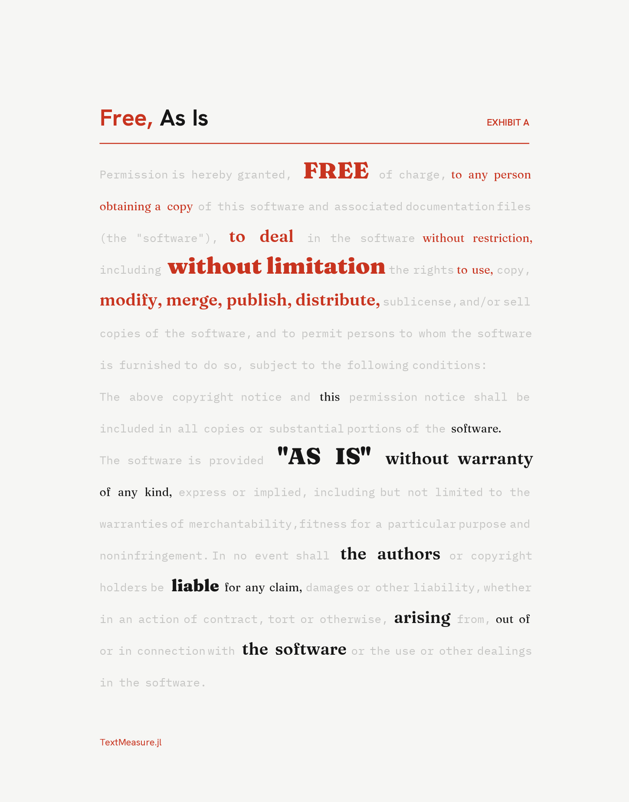

# TextMeasure.jl

A backend-agnostic text **layout engine**: measure once, lay out many times.
Inspired by [pretext.js](https://github.com/chenglou/pretext), using FreeType/Makie
rather than canvas.

```julia
using TextMeasure
using FreeTypeAbstraction                # enables FreeTypeBackend

b   = FreeTypeBackend(; font="DejaVu Sans", fontsize=14)
prp = prepare(b, "The quick brown fox")  # measures once (touches the font engine)
lay = layout(prp; max_width=120, align=:left)   # pure arithmetic — call freely

lay.size                                  # (width, height) in px
for ln in lay.lines
    @show ln.str, ln.x, line_top(lay, ln) # top-left placement, block-top = 0
end
```

Backends: `MonospaceBackend` (zero-dep, built in), `FreeTypeBackend`
(`using FreeTypeAbstraction`), `MakieBackend` (`using Makie`; measurements match
Makie's `text!` at `px_per_unit = 1`), and `FigletBackend` (`using FIGlet`; install
via `Pkg.add("FIGlet")`) — which measures in **character cells** for FIGlet ASCII-art
fonts rather than pixels.

**Not in scope:** rendering, repel/treemap/annotation consumers (downstream), UAX-#14
line-breaking, CJK, hyphenation, justification, rotation.

## Demos / Gallery

The [`examples/`](examples/) directory is a small gallery of measurement-driven pieces built on
this engine — three registers on one house-style spine: *measure once, then **knead · weave ·
place** — many.* See **[examples/README.md](examples/README.md)** for run instructions.

### The Tide — *knead*

<video src="https://github.com/user-attachments/assets/e9bd9d54-4def-4d6d-8b5b-e732e0550d8c" controls muted loop></video>

*A wavy coral tide-line **kneads** a justified prose block — each frame the engine re-flows the
prose into whatever region the wave leaves behind. ▶ inline loop above · [`examples/tide`](examples/tide/)*

### Woven — *weave*

[](examples/woven/)

*The project's own MIT license, laid out once and faded to a ghost, with two found poems **woven**
through it in place — the poems were always in the license text. [`examples/woven`](examples/woven/)*

### The Atlas — *place*

<video src="https://github.com/user-attachments/assets/4e82d0a3-eec8-456f-bc18-7044bf49293e" controls muted loop></video>

*A seamless zoom-dive over the California Central Coast; every place-label is measured here and
**placed** collision-free by MakieTextRepel, live, on every frame as the camera descends. ▶ inline dive above · [`examples/atlas`](examples/atlas/)*
