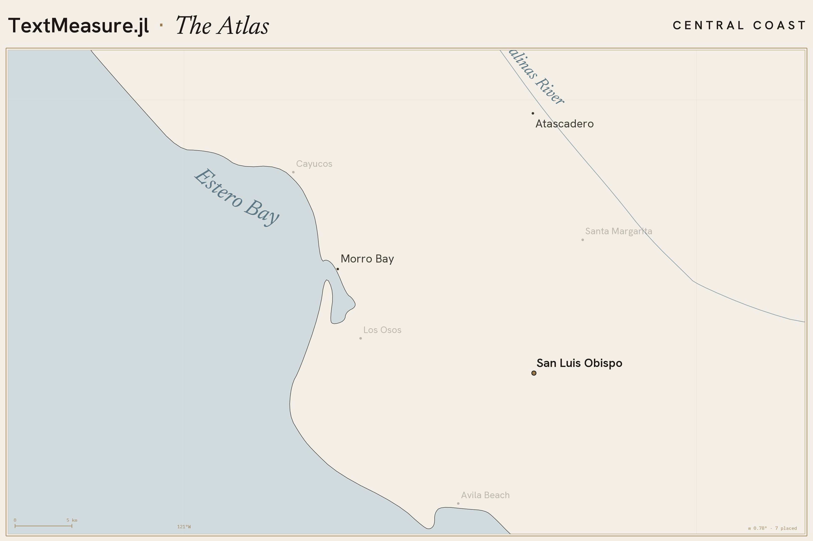

# TextMeasure.jl

A backend-agnostic text **layout engine**: measure once, lay out many times.
Inspired by [pretext.js](https://github.com/chenglou/pretext), using FreeType/Makie
rather than canvas.

```julia
using TextMeasure
using FreeTypeAbstraction                # enables FreeTypeBackend

b   = FreeTypeBackend(; font="DejaVu Sans", fontsize=14)
prp = prepare(b, "The quick brown fox")  # measures once (touches the font engine)
lay = layout(prp; max_width=120, align=:left)   # pure arithmetic — call freely

lay.size                                  # (width, height) in px
for ln in lay.lines
    @show ln.str, ln.x, line_top(lay, ln) # top-left placement, block-top = 0
end
```

Backends: `MonospaceBackend` (zero-dep, built in), `FreeTypeBackend`
(`using FreeTypeAbstraction`), `MakieBackend` (`using Makie`; measurements match
Makie's `text!` at `px_per_unit = 1`), and `FigletBackend` (`using FIGlet`; install
via `Pkg.add("FIGlet")`) — which measures in **character cells** for FIGlet ASCII-art
fonts rather than pixels.

**Not in scope:** rendering, repel/treemap/annotation consumers (downstream), UAX-#14
line-breaking, CJK, hyphenation, justification, rotation.

## Demos / Gallery

The [`examples/`](examples/) directory is a small gallery of measurement-driven gallery
pieces built on this engine — three registers on one house-style spine, *measure once,
then **press · erase · place** — many*:

- **[The Tide](examples/tide/)** — a wavy tide-line *kneads* a justified prose block, the
  engine re-flowing it into the wave's wake every frame.
- **[Woven](examples/woven/)** — the project's MIT license faded to a ghost, with two
  found poems lit in place through it.
- **[The Atlas](examples/atlas/)** — a seamless zoom-dive over the California coast whose
  place-labels are measured here and placed collision-free, live, every frame.

See **[examples/README.md](examples/README.md)** for screenshots and run instructions.

[](examples/atlas/)
