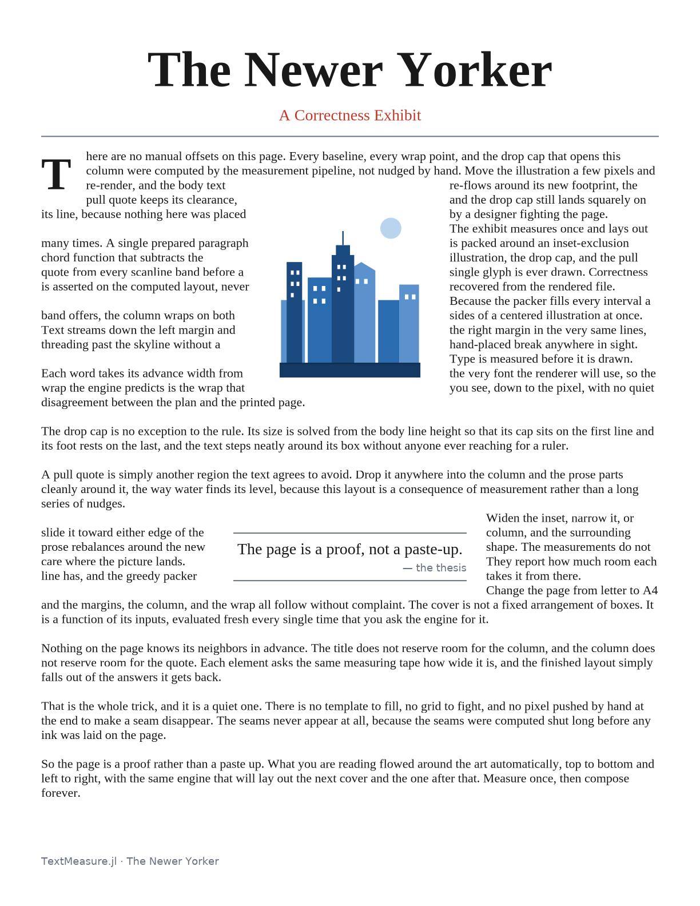
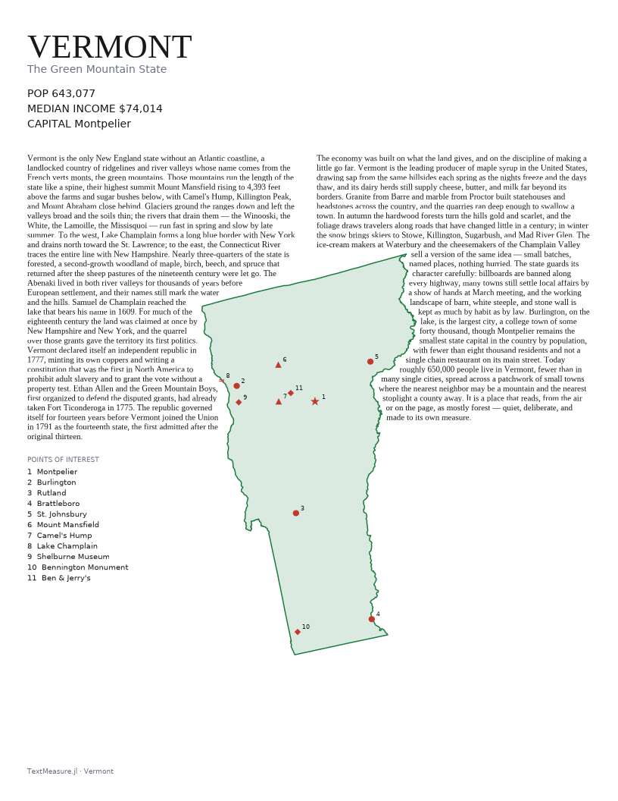
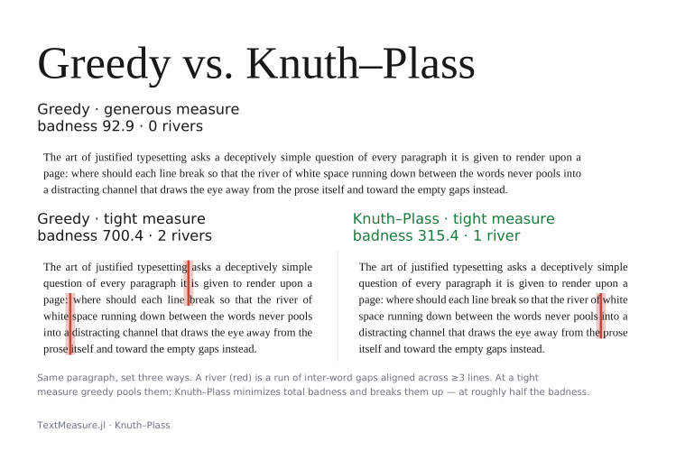

<!-- SPDX-License-Identifier: MIT -->
# TextMeasure.jl — demo gallery

A gallery of **measurement-driven layout** demos built on
[TextMeasure.jl](../README.md): editorial covers, a map feature page, a justification
comparison, shape-conforming text packing, and an adaptive academic-paper infographic.
Each demo is a self-contained Julia project under `examples/<demo>/` with its own
`Project.toml` and `README.md`.

## Running a demo

Every demo activates its own environment and develops the in-repo `TextMeasure`
(and, where used, `TextMeasureLayouts`) packages — they are not registered, so they
must be `dev`-ed from this repo before instantiating:

```bash
# from the repo root — sets up examples/<demo>'s environment
julia --project=examples/<demo> -e 'using Pkg; Pkg.develop([PackageSpec(path="."), PackageSpec(path="examples/layouts")]); Pkg.instantiate()'
```

(`examples/layouts` and `examples/silhouettes` are library-only and depend on
`TextMeasure` alone, so `Pkg.develop(path=".")` suffices for them.) Each demo's own
`README.md` has the exact run command; the per-demo entries below summarize them.

---

## DOIInfograph — adaptive academic-paper infographic (#F)

[](doi_infograph/assets/grid_hero.pdf)

Give it a DOI; it fetches the metadata and *measures* its way to a composed editorial
cover — the title autoshrinks, a long author list collapses to "et al.", the abstract
drop-caps and wraps around a figure pillar, concept pills wrap into a strip. The hero is
a **6-up grid of six very different papers** (short and 125-char titles, 8 to 446 authors,
with and without abstracts), all composed by the *same* template — that uniformity is the
proof of adaptiveness. Runs fully offline from a committed API cache.

GitHub shrinks the PNG; open the high-resolution vector composite for per-panel detail:
**[`grid_hero.pdf`](doi_infograph/assets/grid_hero.pdf)**.

```bash
julia --project=examples/doi_infograph -e 'using Pkg; Pkg.develop([PackageSpec(path="."), PackageSpec(path="examples/layouts")]); Pkg.instantiate()'
julia --project=examples/doi_infograph examples/doi_infograph/render_hero.jl   # regenerates the hero
```

→ [`doi_infograph/README.md`](doi_infograph/README.md)

---

## Cover — the "Newer Yorker" correctness exhibit (#H)



A hand-set editorial cover rendered to a **vector PDF** with CairoMakie: display title,
drop cap, body text flowing around an SVG illustration inset on **both** sides, and a
pull-quote callout. Its job is to prove correctness — the honest acceptance test is
*"no manual offsets"*: move the inset and re-render, and every other element re-aligns
because every offset is measurement-derived.

```bash
julia --project=examples/cover -e 'using Pkg; Pkg.develop([PackageSpec(path="."), PackageSpec(path="examples/layouts")]); Pkg.instantiate()'
julia --project=examples/cover examples/cover/render.jl examples/cover/data/cover-v1.toml /tmp/cover-v1.pdf
```

→ [`cover/README.md`](cover/README.md)

---

## MapFeature — state map-feature page (#G)



A US-state silhouette rendered as a cartographic map (capital, cities, landmarks, natural
features) with **editorial prose that wraps around the silhouette as an irregular
obstacle** — the *Dynamic Layout* pattern applied to real geography. Vermont renders
entirely from a bundled ≈26 KB shapefile and bundled POIs — no network.

```bash
julia --project=examples/map_feature -e 'using Pkg; Pkg.develop([PackageSpec(path="."), PackageSpec(path="examples/layouts")]); Pkg.instantiate()'
julia --project=examples/map_feature examples/map_feature/render_vermont.jl   # writes vermont.png + vermont.pdf
```

→ [`map_feature/README.md`](map_feature/README.md)

---

## Justification — greedy vs. Knuth–Plass (#K, stretch)



The **same paragraph** set three ways — wide greedy, narrow greedy, and narrow
Knuth–Plass — so the cost of greedy line-breaking is visible next to badness-minimized
breaks. A *river* (overlaid in red) is a run of inter-word gaps aligned across ≥3 lines;
at a tight measure greedy pools them and K-P breaks them up at roughly half the badness.

```bash
julia --project=examples/justification -e 'using Pkg; Pkg.develop([PackageSpec(path="."), PackageSpec(path="examples/layouts")]); Pkg.instantiate()'
julia --project=examples/justification examples/justification/demo.jl   # → comparison.pdf
```

→ [`justification/README.md`](justification/README.md)

---

## TextMeasureLayouts — shared layout utilities (#C / #C2 / #K)

*Library, no standalone render.* Houses `shape_pack` (shape-conforming text packing into
the intervals returned by a `chord_fn`, with multi-interval per-band packing for two-sided
wrap) and the stretch `knuth_plass` / `greedy_justify` justification utilities. Consumed by
the cover, map-feature, doi-infograph, and justification demos via `Pkg.develop`.

```bash
julia --project=examples/layouts -e 'using Pkg; Pkg.develop(path="."); Pkg.instantiate()'
julia --project=examples/layouts examples/layouts/test/runtests.jl
```

→ [`layouts/README.md`](layouts/README.md)

---

## Silhouettes — procedural 2-D shapes (#D)

*Library, no standalone render.* Procedural asteroid silhouettes (polar Perlin noise),
Voronoi shatter (`DelaunayTriangulation` + Sutherland–Hodgman clip), and rasterization to
a `BitMatrix` matching `shape_pack`'s `raster_chord_fn` convention. Built for the Asteroid
TUI demo (#E).

```bash
julia --project=examples/silhouettes -e 'using Pkg; Pkg.develop(path="."); Pkg.instantiate(); Pkg.test()'
```

→ [`silhouettes/README.md`](silhouettes/README.md)

---

## Asteroid TUI (#E) — 🚧 work in progress

An interactive terminal demo driving `Silhouettes` + `shape_pack` (text packed into a
fracturing asteroid). **Not yet on `main`** — tracked in draft PR
[#26](https://github.com/jowch/TextMeasure.jl/pull/26). No gallery image yet; its assets
aren't committed.
