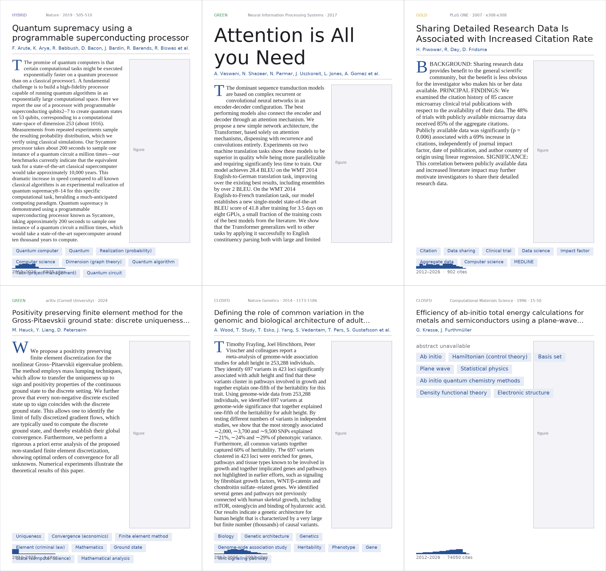

# DOIInfograph

Adaptive, **measurement-driven** academic-paper infographic generator — a CairoMakie demo
for [TextMeasure.jl](../..) and [TextMeasureLayouts](../layouts). Give it a DOI; it fetches
the metadata, then *measures* its way to a composed editorial cover: the title autoshrinks
to fit its box, a long author list collapses to "et al.", the abstract drop-caps and wraps
around a figure pillar via `shape_pack`, concept pills wrap into a strip, and a Unicode
sparkline is width-matched to its caption. The README hero is a 6-up grid of six very
different papers, all composed by the same template — *that* is the proof of adaptiveness.



High-resolution composite PDF (per-panel detail GitHub's PNG shrinks away):
[`assets/grid_hero.pdf`](assets/grid_hero.pdf).

## Quick start

```julia
using Pkg; Pkg.activate("examples/doi_infograph"); Pkg.instantiate()
using DOIInfograph

fig = infograph("10.1038/s41586-019-1666-5"; mailto="you@example.com")   # single cover
grid = grid_infograph(canonical_dois(); mailto="you@example.com")        # the 6-up hero

export_pdf(grid, "grid.pdf")        # single-page vector composite (selectable text)
export_png(grid, "grid.png")        # raster hero (2× by default)
```

Per-paper PDFs are a documented loop, not a built-in option:

```julia
for doi in canonical_dois()
    export_pdf(infograph(doi; mailto="you@example.com"), replace(doi, "/"=>"_") * ".pdf")
end
```

## Offline by default

All six canonical DOIs have their API responses committed under `data/cache/`, so the demo,
its tests, and the hero render **run with no network**. To (re)build the cache from the live
APIs:

```bash
DOIINFOGRAPH_WRITE_CACHE=1 DOIINFOGRAPH_MAILTO=you@example.com \
  julia --project=examples/doi_infograph examples/doi_infograph/data/build_cache.jl
```

Without `DOIINFOGRAPH_WRITE_CACHE=1`, the clients are cache-only and never touch the network.
Rate limits (429) are honored with exponential backoff + `Retry-After` when building.

## Data sources

`fetch_doi_metadata` merges three sources into one `PaperMetadata`:

- **OpenAlex** (primary): title, authors, abstract (reconstructed from the inverted index),
  concepts, citation timeline, open-access status, year, journal, page range.
- **CrossRef**: split given/family author names + journal/page/year/citation fallbacks.
- **Semantic Scholar**: the TLDR, plus an author/abstract/year/OA fallback for arXiv papers.

### `fetch_figure` and publisher ToS

`fetch_doi_metadata(doi; fetch_figure=false)` is the default and **never scrapes**. Opting in
with `fetch_figure=true` scrapes the publisher landing page's `og:image` with an explicit
`User-Agent: TextMeasure.jl DOIInfograph (mailto=…)` header. Respect each publisher's terms of
service before enabling it; the demo ships with a geometric figure placeholder otherwise.

## The six canonical slots

Each stresses a different adaptive primitive (source of truth: `data/canonical_dois.toml`):

| # | DOI | Stresses |
|---|-----|----------|
| 1 | `10.1038/s41586-019-1666-5` (Sycamore) | long title, 77 authors, hybrid OA, abstract+TLDR |
| 2 | `10.48550/arXiv.1706.03762` (Attention) | short title, 8 authors, green OA preprint |
| 3 | `10.1371/journal.pone.0000308` (PLOS ONE) | gold OA, abstract reliably present |
| 4 | `10.48550/arXiv.2405.17090` | 125-char title (autoshrink), no abstract |
| 5 | `10.1038/ng.3097` (GWAS) | **446 authors** → author overflow |
| 6 | `10.1016/0927-0256(96)00008-0` (VASP) | no abstract **and** no TLDR → graceful degradation |

## Pluto notebook

`Demo.jl` is a [Pluto](https://plutojl.org) notebook: paste a DOI, render a single infograph,
drag a slider to reflow the page width, export a PDF. Pluto is **not** a dependency of this
demo (it pins HTTP 1.x, incompatible with this env's HTTP 2.0); instead the notebook's first
cell does `Pkg.activate(@__DIR__)` so it runs under your own Pluto install against this
project's environment:

```julia
import Pluto; Pluto.run()         # then open examples/doi_infograph/Demo.jl
```

## Design notes / deviations

This demo's plan flags six corrections to the original issue spec, verified against live APIs
(see `docs/superpowers/plans/2026-05-28-demos-F-doi-infograph.md`). The headline one:
**SemanticScholar.jl cannot be used here** — its v1.0.0 pins `DataStructures 0.18.x` while
CairoMakie requires `0.19.4`, an unsatisfiable conflict — so the Semantic Scholar client is a
thin HTTP wrapper, mirroring the package's own approach to CrossRef. arXiv DOIs are absent
from OpenAlex/CrossRef (they are DataCite DOIs) and use the `ARXIV:` id scheme on Semantic
Scholar; OpenAlex lookups are lowercased. CairoMakie renders use the pinned fonts **DejaVu
Sans** + **Liberation Serif** so the exported-PDF-text golden reproduces in CI.

MIT-licensed, part of the TextMeasure.jl examples.
